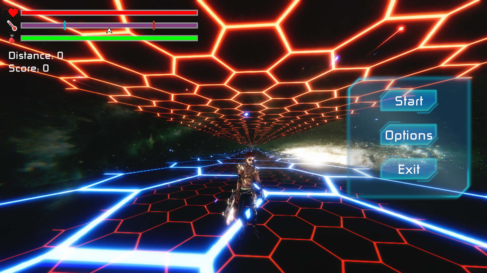

# Yajulu-Task
 Yajulu Task For The Win
**Yajulu Task**

Preview Video: 

Preview Image:

Build is in Assets/Build

**How to Play:**

1-	Avoid electricity.

2-	Platforms have temperature.  Your health will start to go low if your temperature drops below 25% or above 75%.

3-	Think you can manipulate gravity forever and stuck yourself in air? Better keep your Gravity Control Bar because if it reaches 0 you’ll have to wait till it gets full again.

**Programs Used:**

1-	Unity

2-	Audacity

3-	Gimp

4-	Blender

**Patterns Used:**

1-	Singleton

2-	Factory

3-	Dynamic Pool

Extras handmade:

1-	Skateboard animation using Unity animation tool.

2-	Rock shattered model using Blender [Not Used].

**Planned but not made due to time:**

1-	Universal rocks could damage you, shatter into pieces [This effect is already implemented by me in blender and in Unity but not used yet]. Universal rocks have temps too!

2-	Extreme temperatures don’t only damage you. They also affect how fast you move into the universe.

3-	Add time frame after being damaged by electricity so you don’t get hit again.

4-	Add more visual and sound effects to both game and UI.

5-	Make Options button useful.

**Helper Tools Used:**

1-	LeanTween: used for tweening a lot of stuff like [Camera rotation animation, player rotation animation, UI animations].

2-	Cinemachine.

3-	Mixamo: character animations.

**Scripting Managers:**

-	Pool Manager: Loads repeatedly appearing objects effectively like [Universal Rocks & Electricity]
-	Level Manager: uses Pool Manager to Load stuff into scene dynamically & randomly.
-	Sound Manager
-	PP Controller: Manipulates Post Processing profiles for visual effects.
-	Player Controller.
